# Dragos Solomon

Final-year Computer Science student at the University of Bucharest. I build data pipelines and tools, mostly in Python and JavaScript.

[dra-solo.com](https://dra-solo.com) · [Email](mailto:dragos07solomon@gmail.com)

## Projects

### Disruption Intelligence Engine

My bachelor's thesis, still in progress. It collects macro data (FRED), market data (Yahoo Finance) and news into SQLite, flags anomalies with z-scores, and uses Claude to extract events and write hypotheses about which sectors a shock will hit. Each hypothesis has to quote its evidence from the input, and causal chains come from a fixed set of templates, not from the model.

Measured so far, on 35 hypotheses from three historical shocks (COVID 2020, the 2022 energy shock, SVB 2023):

- 0.246 of evidence spans are unsupported by the input, against 0.923 for an unconstrained LLM given the same signals.
- No fabricated numbers, sectors or causal chains.
- Moving one rule from the prompt into the output schema cut its violation rate from 91.4% to 0%.
- 271 tests run offline, and CI fails if grounding gets worse.

Next: retrieving similar past episodes to inform each hypothesis, an agent that tries to disprove hypotheses by checking real data, and an API. The code is private while I finish the thesis.

`Python` `Claude API` `SQLite` `pandas` `Streamlit` `pytest`

### Life OS · [dra-solo.com](https://dra-solo.com)

My own tracker for habits, training and food. One Cloudflare Worker serves both the site and its API from a D1 database. NFC tags around my home log a habit with one tap. Logs are append-only, and totals are computed when read, never stored. There is no build step and no npm dependency. GitHub Actions deploys it, and a smoke test checks every route.

`JavaScript` `Cloudflare Workers` `D1 (SQLite)`

### Computer vision · [CAVA](https://github.com/drasolo/CAVA)

Coursework built with OpenCV and scikit-learn. One assignment scores a Qwirkle game from a photo of the board: it straightens the board with a homography, classifies each tile and validates the moves. The other detects cartoon faces with HOG features, a linear SVM and a sliding window.

`Python` `OpenCV` `scikit-learn`

### Smaller projects

- [fast-read-bold](https://github.com/drasolo/fast-read-bold): a Chrome extension that bolds the start of each word, plus a word-by-word speed reader.
- [MyShell](https://github.com/drasolo/OS_project): a Unix shell in C with pipes, redirection and background jobs.
- [Wordle solver](https://github.com/drasolo/CSA_Project): picks each guess by Shannon entropy, with a Tkinter GUI.
- [character.ai-style API](https://github.com/blankFMI/service): a team project in Spring Boot, MongoDB and Docker.

## Experience

**Intern, Electrolux Group** · Bucharest · 2026

- Built GA4 funnel dashboards in D3.js with Python build scripts. GA4 names product categories differently when a product is viewed and when it is bought, so I joined the data on product model to make the funnel line up.
- Built a generator for Google Ads sitelink text that serves only approved copy and checks every benefit claim against the online store's terms and conditions.
- Built a crawler that collected over 13,000 pages and PDFs from Electrolux sites in 8 EU markets for a review under the EU's EmpCo greenwashing rules.

**Intern, Nuvei**

- Built a C# .NET microservice that takes XML requests over HTTP, validates them with an MD5 hash, logs every failure, and ships through CI/CD with unit tests.

## Tech

## Stats

  <picture>
    <source media="(prefers-color-scheme: dark)" srcset="profile/stats-dark.svg">
    
  </picture>
  <picture>
    <source media="(prefers-color-scheme: dark)" srcset="profile/langs-dark.svg">
    
  </picture>

